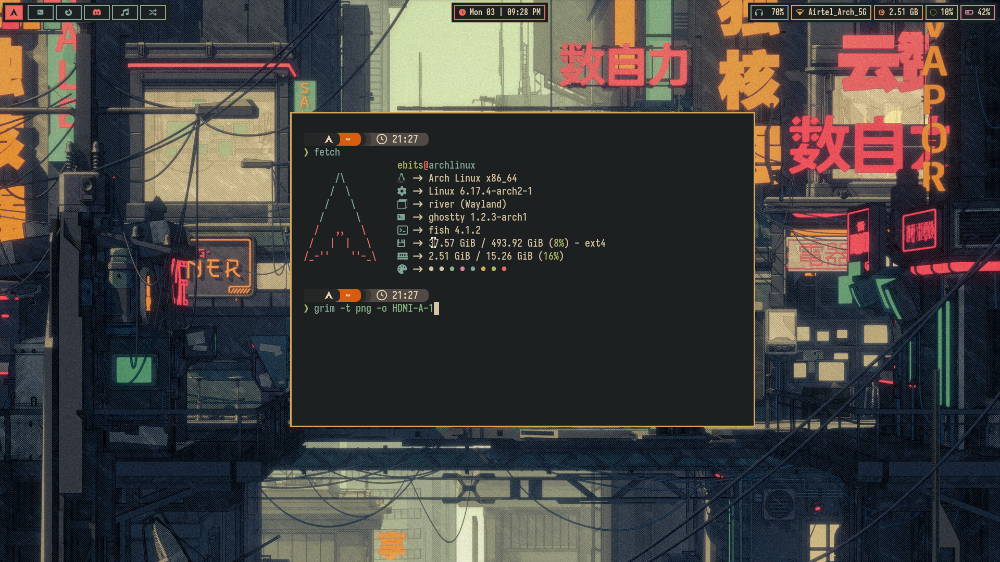
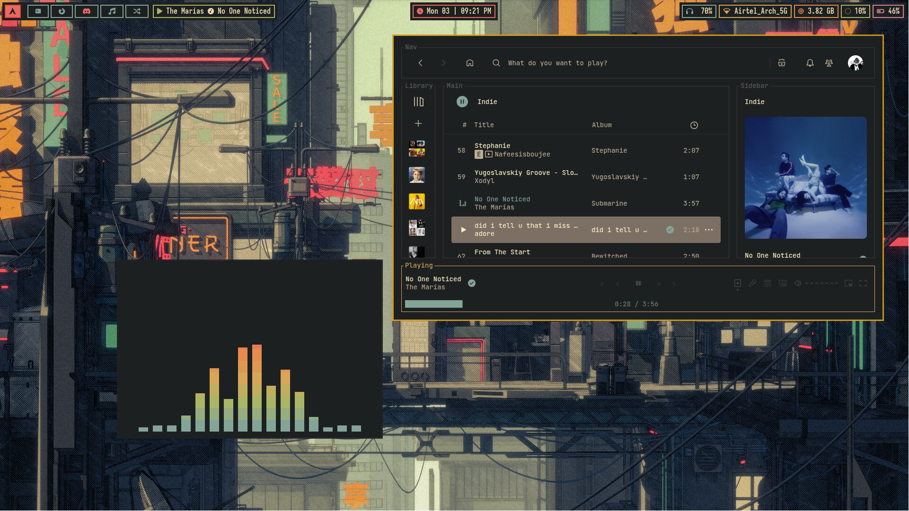
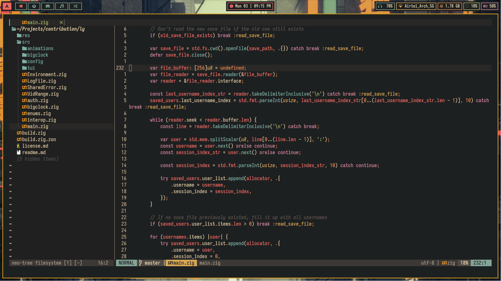
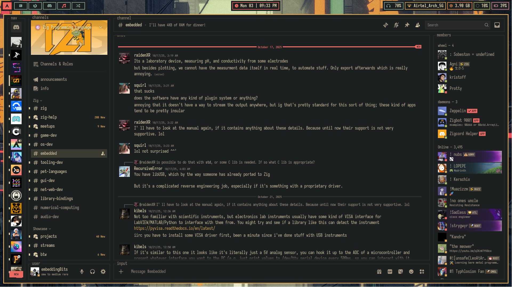
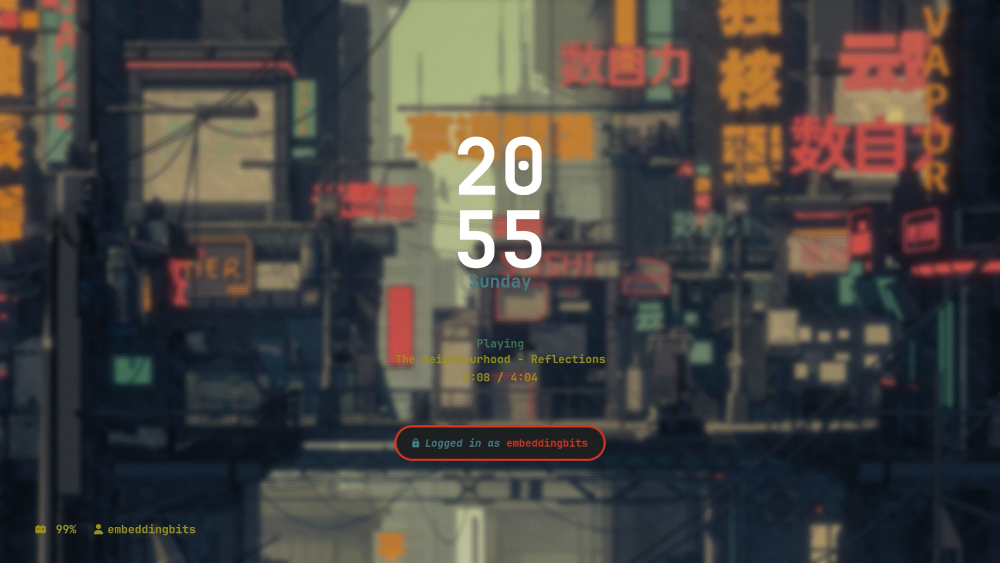

# Software
-   **Distro**: [Arch](https://archlinux.org)
-   **Window manager**: [River](https://codeberg.org/river)
-   **Top bar**: [Waybar](https://github.com/alexys/waybar)
-   **Terminal**: [Ghostty](https://ghostty.org)
-   **Text editor**: [neovim](https://github.com/neovim/neovim)
-   **Application opener**: [rofi](https://github.com/davatorium/rofi)
-   **Visual candy**: [pipes.sh](https://github.com/pipeseroni/pipes.sh)
-   **Shell**: [fish](https://github.com/fish-shell/fish-shell)
-   **Spotify**: [Spicetify](https://github.com/spicetify)
-   **Discord**: [Discord](https://betterdiscord.app/)


# Gruvbox Rice








## How to apply

Install GNU Stow. Stow is a dotfile manager. It makes applying and getting our dotfiles setup easier.

```bash
stow gruvbox_config
```
