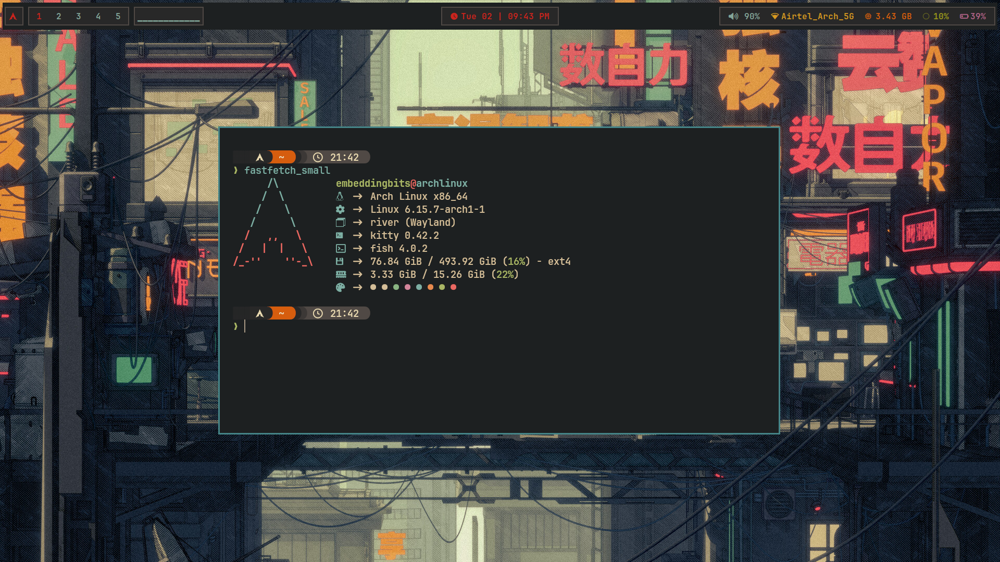
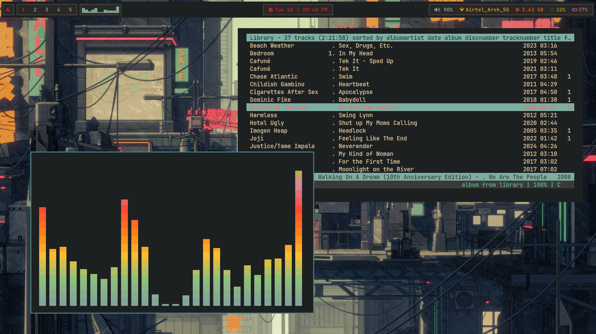
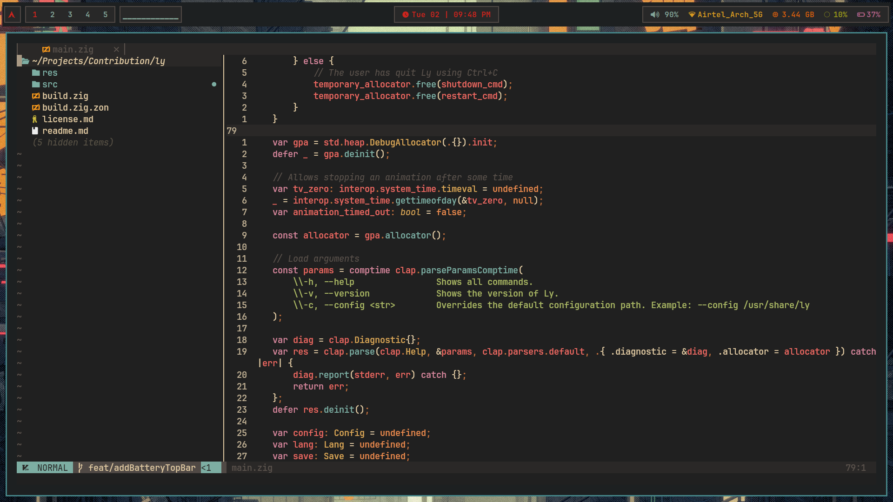
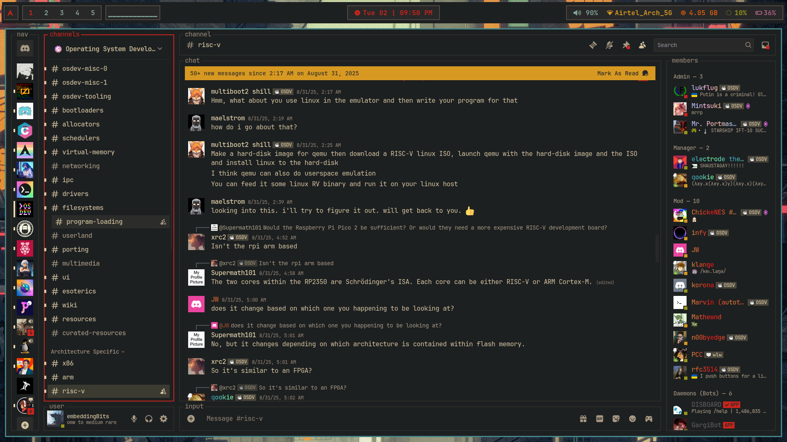
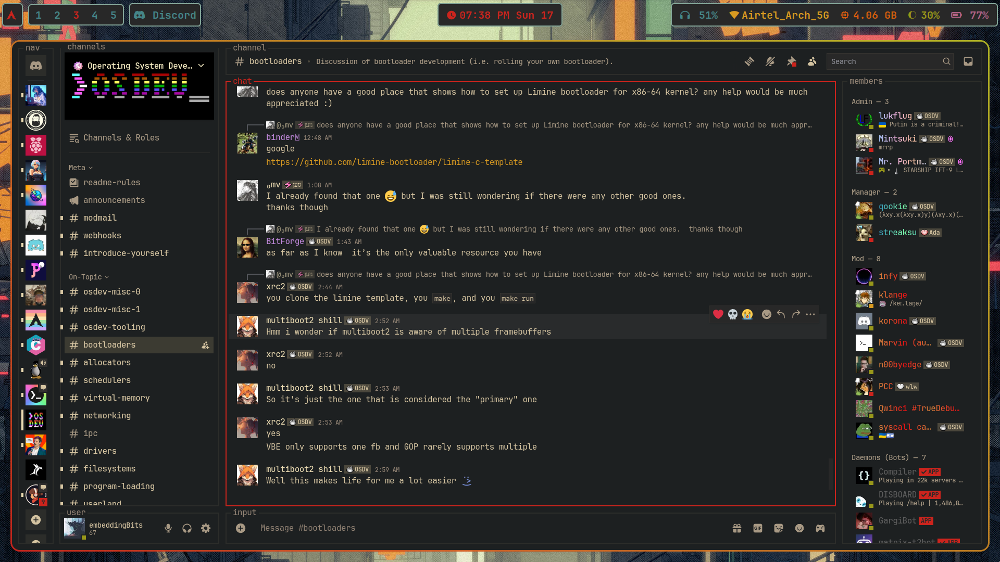
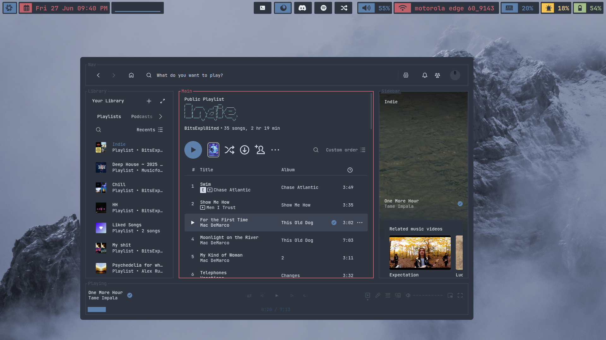
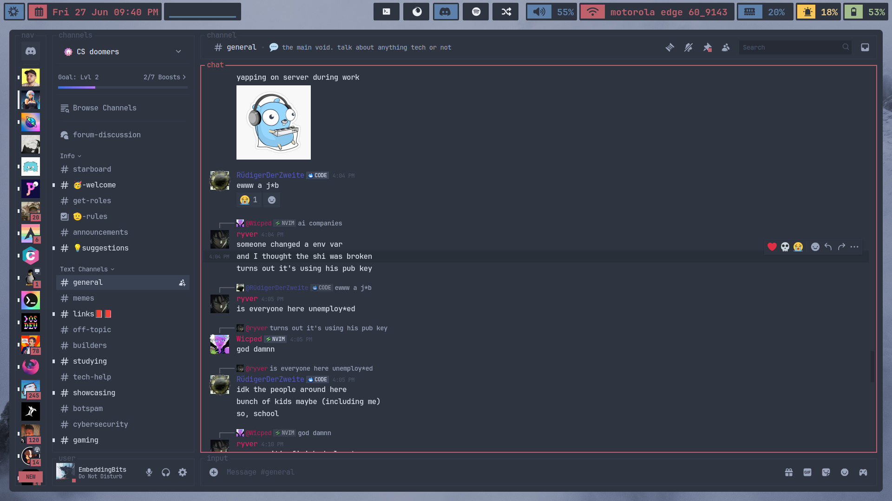

# Software
-   **Distro**: [Arch](https://archlinux.org)
-   **Window manager**: [Hyprland](https://hyprland.org/)
-   **Top bar**: [HyprPanel](https://hyprpanel.com/)
-   **Terminal**: [kitty](https://github.com/kovidgoyal/kitty)
-   **Text editor**: [neovim](https://github.com/neovim/neovim)
-   **Application opener**: [rofi](https://github.com/davatorium/rofi)
-   **Visual candy**: [pipes.sh](https://github.com/pipeseroni/pipes.sh)
-   **Shell**: [fish](https://github.com/fish-shell/fish-shell)
-   **Spotify**: [Spicetify](https://github.com/spicetify)
-   **Discord**: [Discord](https://betterdiscord.app/)


# Gruvbox Rice






# Gruvbox Rice




# Nord Rice





## How to apply

Install GNU Stow. Stow is a dotfile manager. It makes applying and getting our dotfiles setup easier.

```bash
sudo pacman -S stow
```
```bash
stow <package_name>
```

For example if you want to setup up nvim then:
```bash
stow nvim-config
```

The files are symlinked and not actually placed in them.

There are two different themes:

- Gruvbox
- Nord

There are files with different colors schemes which you can choose from.

For `zathura` there is `zathura_nord` and `zathura_gruv`. For applications like Rofi, there is `gruvbox.rasi` and `nord.rasi`.

To choose for Rofi you have to change the color scheme file in `config.rasi`.

Similarly for `cava`, there are two folders each containing different color schemes in `.config/cava/gruvbox` and `.config/cava/nord`. You have to copy the `config` file from the desired folder to the `.config/cava/config`
