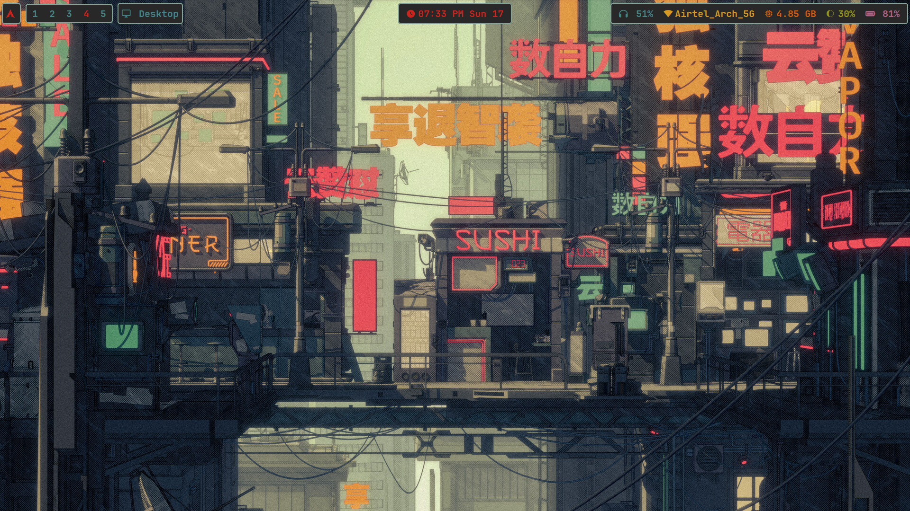
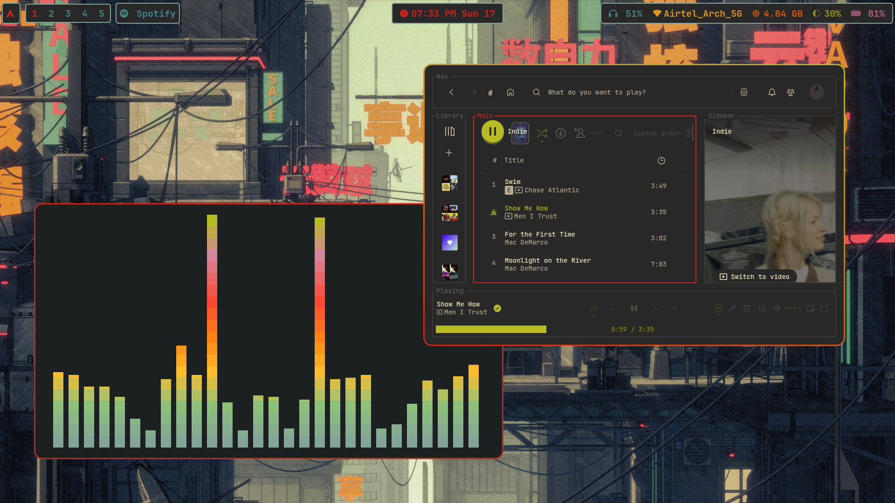
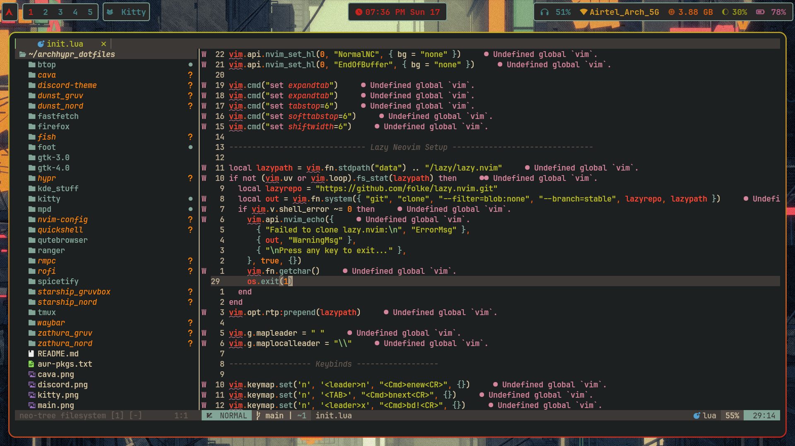
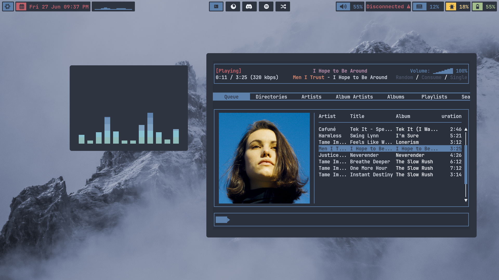
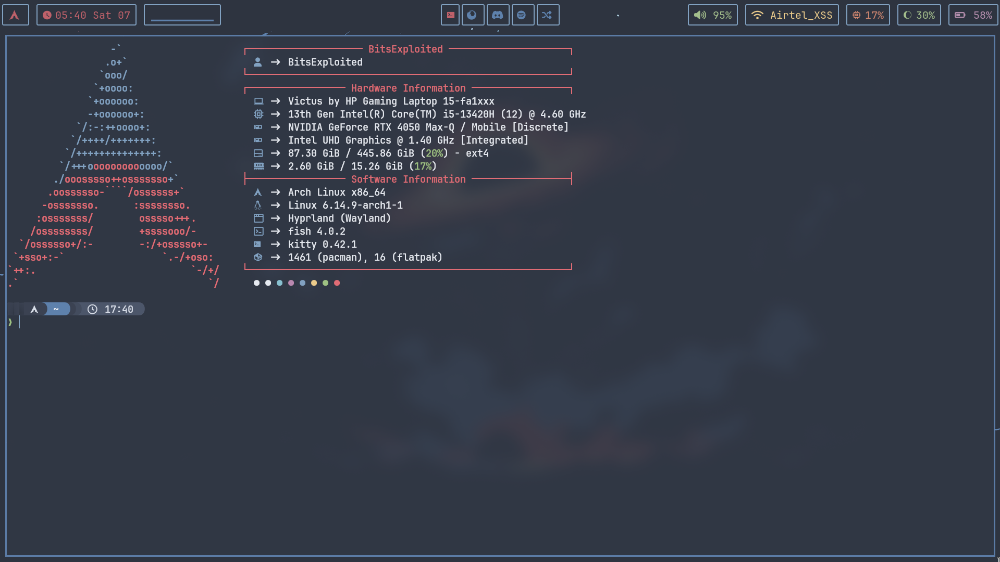
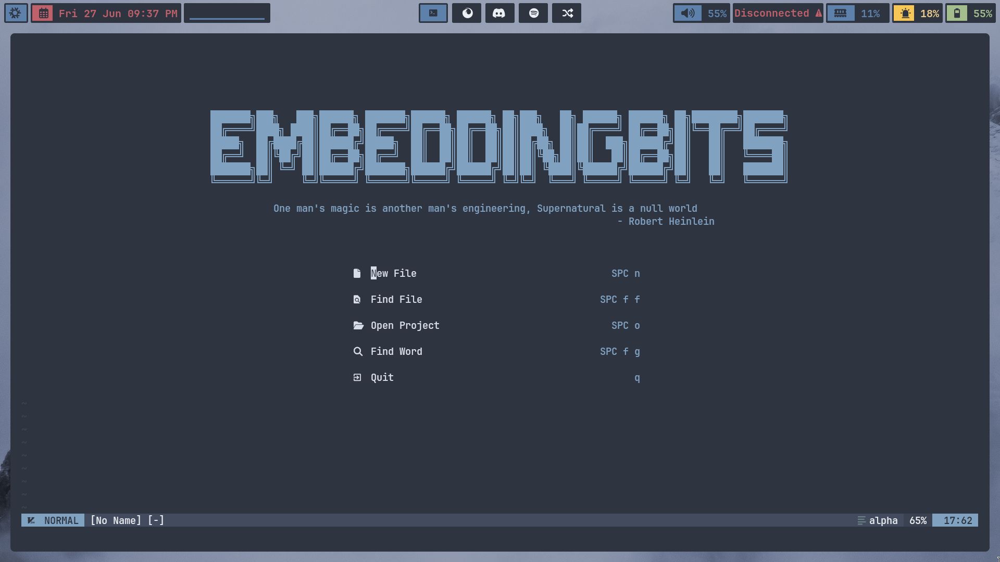

# Software
-   **Distro**: [Arch](https://archlinux.org)
-   **Window manager**: [Hyprland](https://hyprland.org/)
-   **Top bar**: [HyprPanel](https://hyprpanel.com/)
-   **Terminal**: [kitty](https://github.com/kovidgoyal/kitty)
-   **Text editor**: [neovim](https://github.com/neovim/neovim)
-   **Application opener**: [rofi](https://github.com/davatorium/rofi)
-   **Visual candy**: [pipes.sh](https://github.com/pipeseroni/pipes.sh)
-   **Shell**: [fish](https://github.com/fish-shell/fish-shell)
-   **Spotify**: [Spicetify](https://github.com/spicetify)
-   **Discord**: [Discord](https://betterdiscord.app/)

# Gruvbox Rice

# Nord Rice

