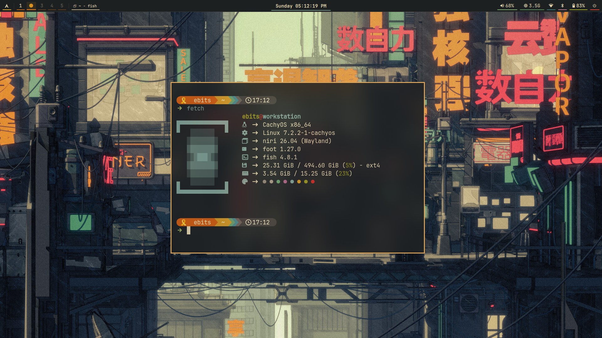
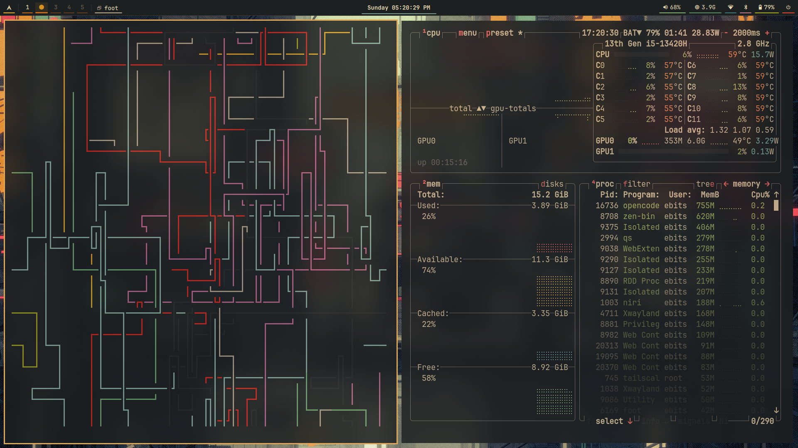
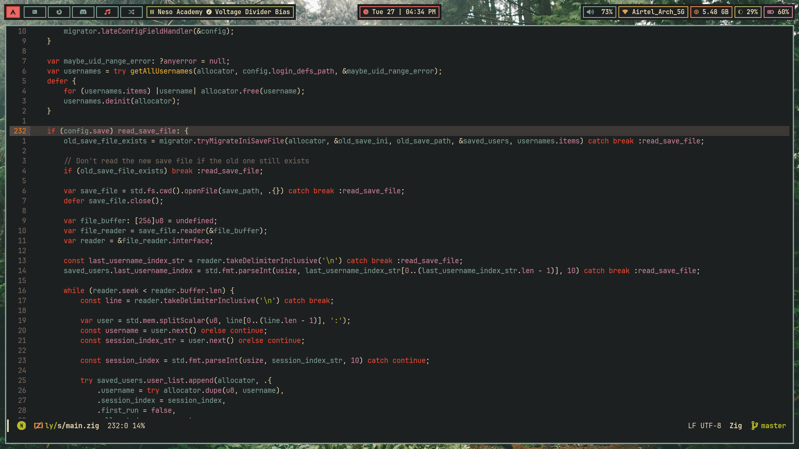
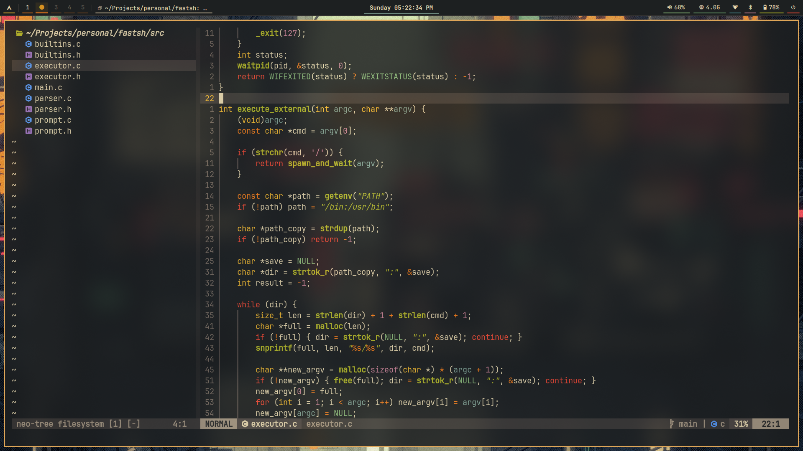
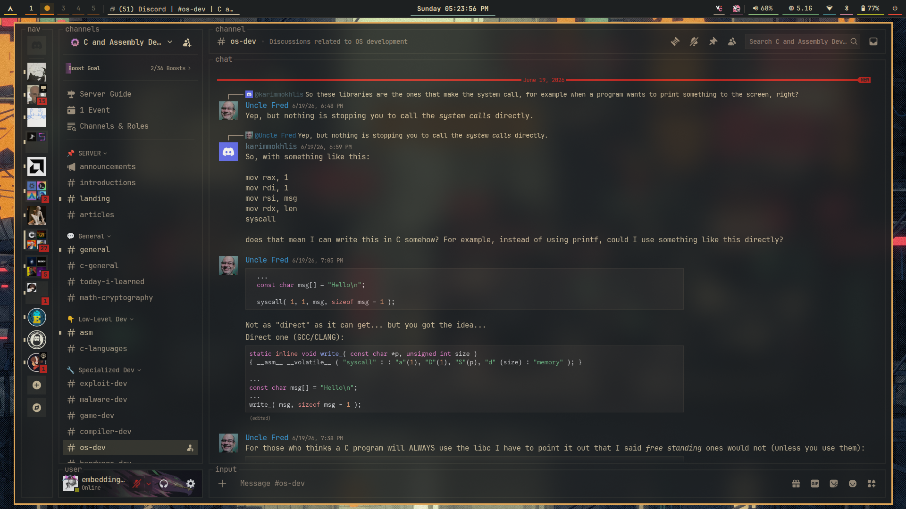

#+startup: inlineimages

* Software
- *Distro*: [[https://archlinux.org/][Arch Linux]]
- *Window manager*: [[https://niri-wm.github.io/niri/index.html][Niri]]
- *Top bar*: [[https://github.com/alexys/waybar][Waybar]]
- *Terminal*: [[https://codeberg.org/dnkl/foot][foot]]
- *Text editor*: [[https://www.gnu.org/software/emacs/][Emacs]] and [[https://neovim.io/][Neovim]]
- *Application Launcher*: [[https://codeberg.org/dnkl/fuzzel][Fuzzel]]
- *Visual candy*: [[https://github.com/pipeseroni/pipes.sh][pipes.sh]]
- *Shell*: [[https://github.com/fish-shell/fish-shell][fish]]
- *Spotify*: [[https://github.com/spicetify][Spicetify]]
- *Discord*: [[https://betterdiscord.app][Discord]]

* Gruvbox Rice

* Reproducible Installation

Dotfiles are managed with [[https://www.gnu.org/software/stow/][GNU Stow]].

Packages are categorized in =packages.lst= for modular, selective installation.
The =install.sh= script orchestrates a full reproducible bootstrap.

** Quick start (full install)

#+begin_src bash
./install.sh
#+end_src

This runs all stages:
1. System sync & update (=pacman -Syu=)
2. Multilib repository (=/etc/pacman.conf=)
3. Install all package groups from =packages.lst= (=pacman -S= / AUR helper)
4. Enable systemd services (NetworkManager, bluetooth, pipewire --user)
5. Add user to required groups (input, video, audio, wheel)
6. Stow dotfiles (dotfiles/, emacs/, nvim-config/)

** Selective install

Install only specific package groups:

#+begin_src bash
./install.sh --group dev,tools
#+end_src

** Manual stow (if not using install.sh)

#+begin_src bash
stow dotfiles
stow emacs
stow nvim-config
#+end_src
